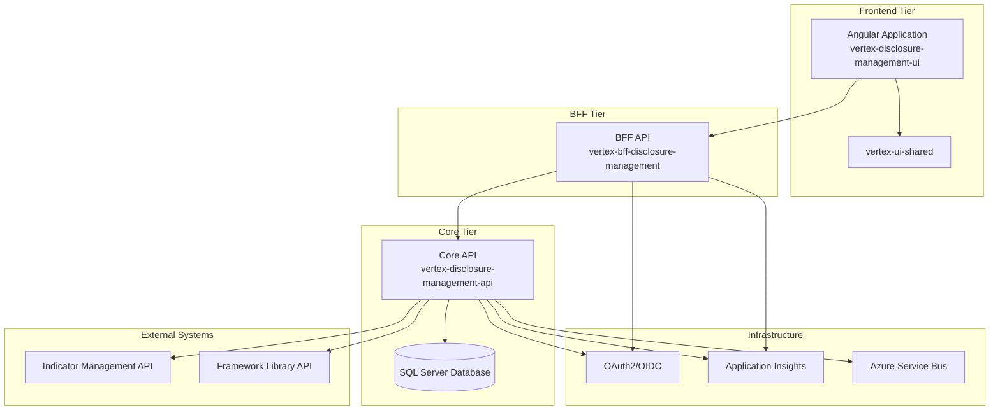

### **Technical Design Document: Disclosure Management**

**Implementation Context:**
*   **Domain:** `disclosure-management`
*   **Projects to Create:**
    - `vertex-disclosure-management-ui` (Angular Frontend)
    - `vertex-bff-disclosure-management` (Backend-for-Frontend API)
    - `vertex-disclosure-management-api` (Core CRUD API)
*   **Base Templates:** Leveraging vertex-cursor-templates and vertex-dotnet-api-sdk as foundation

### **1. Product Overview**

**1.1. Purpose & Problem Statement**
The Disclosure Management platform addresses the critical gap in ESG reporting where organizations can collect sustainability data but lack the ability to create complete, framework-compliant disclosure reports. The system enables users to select from standardized frameworks (CDP, CSRD/ESRS, SEC Climate Rule), leverage existing data from Indicator Management systems, and complete comprehensive disclosure reports with professional authoring capabilities. Users benefit from streamlined workflows that reduce report preparation time by 90% while ensuring regulatory compliance and professional presentation standards.

**1.2. Target Audience**
*   **Persona 1:** ESG Manager - Mid-level sustainability professionals responsible for managing multiple disclosure frameworks with tight regulatory deadlines
*   **Persona 2:** Sustainability Consultant - External advisors working across multiple organizations requiring flexible, professional-grade disclosure authoring tools
*   **Persona 3:** Corporate Sustainability Director - Senior executives needing high-level visibility into disclosure completion status and organizational compliance tracking

**1.3. Expected Outcomes & KPIs**
*   **Qualitative Outcomes:**
    *   Dramatically improved efficiency in disclosure report creation and management
    *   Enhanced collaboration capabilities for team-based reporting workflows
    *   Professional-grade output quality that meets regulatory submission standards
*   **Key Performance Indicators (KPIs):**
    *   90% reduction in average disclosure report creation time compared to manual processes
    *   85% completion rate for initiated disclosure reports within first 6 months
    *   95% successful integration rate with existing Indicator Management data sources
    *   500 active users within 6 months, expanding to 1,500 users within 12 months

### **2. Design Details**

**2.1. Architectural Overview**

**Standard Vertex Architecture:**


**Component Responsibilities:**
*   **Angular Frontend:** Modern single-page application with dashboard analytics, framework browsing, report authoring workspace, collaboration tools, and export functionality
*   **BFF API:** Data aggregation for UI-specific views, report progress calculations, user-specific filtering, and integration with authentication services
*   **Core API:** Business logic for framework management, report lifecycle management, answer validation, status calculations, and data integration orchestration
*   **Database:** Persistent storage with comprehensive audit trails, optimized for complex queries across organizational boundaries

**2.2. Data Structures and Algorithms**

**Entity Base Class Selection:**
- **NamedEntityBase**: Framework, Report, FileMetadata (entities with descriptive names)
- **EntityBase**: FrameworkQuestion, ReportAnswer (entities without names but requiring full audit tracking)

**Core Domain Entities:**
```csharp
// Framework Entity - NamedEntityBase for frameworks with descriptive names
public class FrameworkEntity : NamedEntityBase
{
    public string ExternalFrameworkId { get; set; } = string.Empty;  // Source system reference
    public string Version { get; set; } = string.Empty;             // Framework version tracking
    public string? Description { get; set; }                        // Framework description
    public string? Source { get; set; }                             // e.g., GRI, SASB, TCFD
    public DateTime ImportedAt { get; set; }                        // Import timestamp
    public bool IsActive { get; set; }                              // Active status flag
    // Inherited: Id (ResourceId), Name, CreatedBy, CreatedDate, LastUpdatedBy, LastUpdatedDate
}

public class FrameworkEntityConfiguration : NamedEntityBaseConfiguration<FrameworkEntity>
{
    protected override string IdColumnName => "Framework_Id";

    public override void Configure(EntityTypeBuilder<FrameworkEntity> builder)
    {
        base.Configure(builder);
        
        builder.ToTable("Frameworks");
        builder.Property(e => e.ExternalFrameworkId).HasMaxLength(PlatformConstants.MaxResourceIdLength);
        builder.Property(e => e.Version).HasMaxLength(54);
        builder.Property(e => e.Source).HasMaxLength(54);
        builder.HasIndex(e => e.ExternalFrameworkId);
        builder.HasIndex(e => e.IsActive);
    }
}

// Report Entity - NamedEntityBase for reports with descriptive names
public class ReportEntity : NamedEntityBase
{
    public string OrganizationId { get; set; } = string.Empty;      // Organizational boundary
    public string FrameworkId { get; set; } = string.Empty;        // Framework reference
    public string? Description { get; set; }                       // Report description
    public DateTime? ReportingPeriodStart { get; set; }           // Reporting period
    public DateTime? ReportingPeriodEnd { get; set; }             // Reporting period
    public DateTime? DueDate { get; set; }                        // Submission deadline
    public string Status { get; set; } = string.Empty;            // Workflow status
    public string? AssignedToUserId { get; set; }                 // Assignment tracking
    public string Metadata { get; set; } = string.Empty;          // JSON metadata
    // Inherited: Id (ResourceId), Name, CreatedBy, CreatedDate, LastUpdatedBy, LastUpdatedDate
}

// FrameworkQuestion Entity - EntityBase for questions without names
public class FrameworkQuestionEntity : EntityBase
{
    public string FrameworkId { get; set; } = string.Empty;        // Framework reference
    public string DisclosureId { get; set; } = string.Empty;       // Disclosure grouping
    public string? ParentQuestionId { get; set; }                  // Hierarchical structure
    public int OrderIndex { get; set; }                            // Display ordering
    public string QuestionCode { get; set; } = string.Empty;       // Unique question code
    public string QuestionText { get; set; } = string.Empty;       // Question content
    public string? GuidanceText { get; set; }                      // Help text
    public string DataType { get; set; } = string.Empty;           // Answer data type
    public string? OptionsJson { get; set; }                       // Available options (JSON)
    public bool IsRequired { get; set; }                           // Required flag
    public bool IsActive { get; set; }                             // Active status
    // Inherited: Id (ResourceId), CreatedBy, CreatedDate, LastUpdatedBy, LastUpdatedDate
}

// ReportAnswer Entity - EntityBase for answers without names
public class ReportAnswerEntity : EntityBase
{
    public string ReportId { get; set; } = string.Empty;           // Report reference
    public string FrameworkQuestionId { get; set; } = string.Empty; // Question reference
    public string OrganizationId { get; set; } = string.Empty;     // Organizational boundary
    public string? AnswerValueText { get; set; }                   // Text answers
    public decimal? AnswerValueNumber { get; set; }                // Numeric answers
    public bool? AnswerValueBoolean { get; set; }                  // Boolean answers
    public DateTime? AnswerValueDate { get; set; }                 // Date answers
    public string AnswerValueJson { get; set; } = string.Empty;    // Complete answer data (JSON)
    public string? FileReferenceId { get; set; }                   // File attachment reference
    public string SourceOfData { get; set; } = string.Empty;       // Data source tracking
    public long? ConfidenceScore { get; set; }                     // Answer confidence
    public string? Notes { get; set; }                             // Additional notes
    public string VersionHistory { get; set; } = string.Empty;     // Answer version history (JSON)
    // Inherited: Id (ResourceId), CreatedBy, CreatedDate, LastUpdatedBy, LastUpdatedDate
}

// FileMetadata Entity - NamedEntityBase for file tracking
public class FileMetadataEntity : NamedEntityBase
{
    public string OrganizationId { get; set; } = string.Empty;     // Organizational boundary
    public string? ReportAnswerId { get; set; }                    // Optional answer reference
    public string MimeType { get; set; } = string.Empty;           // File type
    public long SizeBytes { get; set; }                            // File size
    public string StoragePath { get; set; } = string.Empty;        // Storage location
    // Inherited: Id (ResourceId), Name, CreatedBy, CreatedDate, LastUpdatedBy, LastUpdatedDate
}
```

**Repository Interfaces:**
```csharp
// CRITICAL: All repositories implement IEFRepository<TEntity> from vertex-dotnet-api-sdk
public interface IFrameworkRepository : IEFRepository<FrameworkEntity>
{
    Task<IEnumerable<FrameworkEntity>> GetActiveFrameworksAsync();
    Task<FrameworkEntity?> GetByExternalIdAsync(string externalFrameworkId);
    Task<IEnumerable<FrameworkEntity>> GetBySourceAsync(string source);
}

public interface IReportRepository : IEFRepository<ReportEntity>
{
    Task<IEnumerable<ReportEntity>> GetByOrganizationIdAsync(string organizationId);
    Task<IEnumerable<ReportEntity>> GetByFrameworkIdAsync(string frameworkId);
    Task<IEnumerable<ReportEntity>> GetByStatusAsync(string status);
    Task<IEnumerable<ReportEntity>> GetByAssignedUserIdAsync(string userId);
}

public interface IReportAnswerRepository : IEFRepository<ReportAnswerEntity>
{
    Task<IEnumerable<ReportAnswerEntity>> GetByReportIdAsync(string reportId);
    Task<IEnumerable<ReportAnswerEntity>> GetByFrameworkQuestionIdAsync(string questionId);
    Task<ReportAnswerEntity?> GetByReportAndQuestionAsync(string reportId, string questionId);
}
```

**API Models:**
```csharp
public class Framework
{
    public string Id { get; set; } = string.Empty;
    public string Name { get; set; } = string.Empty;
    public string ExternalFrameworkId { get; set; } = string.Empty;
    public string Version { get; set; } = string.Empty;
    public string? Description { get; set; }
    public string? Source { get; set; }
    public DateTime ImportedAt { get; set; }
    public bool IsActive { get; set; }
    public DateTime CreatedDate { get; set; }
}

public class Report
{
    public string Id { get; set; } = string.Empty;
    public string Name { get; set; } = string.Empty;
    public string OrganizationId { get; set; } = string.Empty;
    public string FrameworkId { get; set; } = string.Empty;
    public string? Description { get; set; }
    public DateTime? ReportingPeriodStart { get; set; }
    public DateTime? ReportingPeriodEnd { get; set; }
    public DateTime? DueDate { get; set; }
    public string Status { get; set; } = string.Empty;
    public string? AssignedToUserId { get; set; }
    public string Metadata { get; set; } = string.Empty;
    public DateTime CreatedDate { get; set; }
    public DateTime LastUpdatedDate { get; set; }
    public Framework? Framework { get; set; }
}

public class CreateReportCommand
{
    public string Name { get; set; } = string.Empty;
    public string OrganizationId { get; set; } = string.Empty;
    public string FrameworkId { get; set; } = string.Empty;
    public string? Description { get; set; }
    public DateTime? ReportingPeriodStart { get; set; }
    public DateTime? ReportingPeriodEnd { get; set; }
    public DateTime? DueDate { get; set; }
}

public class UpdateReportAnswerCommand
{
    public string ReportId { get; set; } = string.Empty;
    public string FrameworkQuestionId { get; set; } = string.Empty;
    public string? AnswerValueText { get; set; }
    public decimal? AnswerValueNumber { get; set; }
    public bool? AnswerValueBoolean { get; set; }
    public DateTime? AnswerValueDate { get; set; }
    public string? FileReferenceId { get; set; }
    public string SourceOfData { get; set; } = string.Empty;
    public long? ConfidenceScore { get; set; }
    public string? Notes { get; set; }
}
```

**Resource ID Format:**
All entities use ResourceId format: `dm_<assetType>_<guid>` (VARCHAR(54))
```csharp
// Examples for disclosure-management domain:
// "dm_frm_11a2b3c4d5e6f789012345678901ab" (Framework)
// "dm_rpt_11a2b3c4d5e6f789012345678901ab" (Report)
// "dm_fqn_11a2b3c4d5e6f789012345678901ab" (FrameworkQuestion)
// "dm_ans_11a2b3c4d5e6f789012345678901ab" (ReportAnswer)
// "dm_fil_11a2b3c4d5e6f789012345678901ab" (FileMetadata)
```

**Business Logic Algorithms:**
*   **CQRS Operations:** Complete separation of read and write operations using MediatR pattern with dedicated Command and Query handlers
*   **Validation:** FluentValidation implementation for comprehensive input validation with framework-specific business rules
*   **Status Calculation:** Automated report status calculation based on completion percentage and answer validation results
*   **Data Integration:** Orchestrated data population from Indicator Management with conflict resolution and data quality scoring
*   **Version Management:** Comprehensive audit trails with answer version history for regulatory compliance and change tracking

**2.3. System Interfaces**

*   **API Endpoints:**
    - **GET /frameworks** - List available frameworks with filtering by source and active status
    - **GET /frameworks/{id}/questions** - Retrieve framework questions with hierarchical structure
    - **POST /reports** - Create new disclosure report with framework selection and organizational context
    - **GET /reports** - List reports with filtering by organization, status, and assigned user
    - **GET /reports/{id}** - Retrieve complete report with answers and progress calculation
    - **PUT /reports/{id}/answers** - Update report answers with validation and status recalculation
    - **GET /reports/{id}/status** - Real-time status calculation with completion percentage
    - **POST /reports/{id}/export** - Generate professional export in multiple formats (PDF, Word, Excel)

*   **Third-Party Services:**
    - **Indicator Management API** - Integration for automatic data population from existing sustainability metrics
    - **Framework Library API** - External framework provider integration for up-to-date question sets and compliance requirements
    - **Document Generation Services** - Professional document export capabilities with template customization
    - **Azure Service Bus** - Asynchronous processing for data integration and workflow notifications

*   **Internal Modules:**
    - **Authentication Service** - OAuth2/OIDC integration with organizational boundary enforcement
    - **File Storage Service** - Secure file upload and storage for report attachments
    - **Notification Service** - Workflow notifications for assignments, deadlines, and completion milestones
    - **Audit Service** - Comprehensive logging for regulatory compliance and change tracking

**2.4. User Interfaces (UI)**

*   **Dashboard Component** - Executive overview with completion statistics, framework availability, and quick action tiles for efficient navigation
*   **Framework Library Component** - Comprehensive framework browsing with detailed question preview and selection capabilities
*   **Report Creation Wizard** - Guided workflow for framework selection, organizational context, and reporting period configuration
*   **Report Workspace Component** - Professional authoring environment with question navigation, progress tracking, and collaborative features
*   **Answer Editor Components** - Specialized input controls for different data types (text, numeric, boolean, date) with validation and guidance
*   **File Upload Component** - Drag-and-drop file attachment with progress tracking and metadata capture
*   **Export Configuration Component** - Professional export options with format selection and customization capabilities
*   **Collaboration Panel Component** - Assignment management, progress tracking, and communication tools for team-based workflows

**2.5. Hardware Interfaces**

No special hardware interfaces are required as this is a software-based platform designed for standard web browser access across desktop and tablet devices. The system is optimized for modern web browsers with responsive design principles ensuring usability across various screen sizes and input methods.

### **3. Testing Plan**

**3.1. Test Strategy**

*   **Unit Testing:** Comprehensive testing of individual components including CQRS handlers, validation logic, business rule enforcement, and data transformation functions with 90%+ code coverage targets
*   **Integration Testing:** Full API endpoint testing with database operations, authentication flows, external service integration, and cross-component communication validation
*   **System Testing:** End-to-end user workflow validation including complete report creation, collaborative editing, data integration, and export functionality across supported browsers
*   **User Acceptance Testing (UAT):** Stakeholder validation sessions with ESG professionals testing real-world disclosure scenarios and workflow efficiency

**3.2. Testing Tools**

*   **Unit Testing:** xUnit (.NET Core), Jest (Angular), with comprehensive mocking frameworks for isolated testing
*   **Integration/API Testing:** Custom integration test framework built on .NET Core TestHost for realistic API testing scenarios
*   **System (E2E) Testing:** Playwright for comprehensive browser automation and cross-browser compatibility validation
*   **Performance Testing:** NBomber for load testing and performance benchmarking under realistic usage scenarios
*   **UAT Feedback:** Structured feedback collection through integrated survey tools and user session recording

**3.3. Test Environments**

*   **Development:** Local developer environments with Docker containerization for consistent development experience
*   **Staging/QA:** Azure-hosted environment mirroring production configuration for comprehensive pre-production validation
*   **Production:** Live Azure environment with comprehensive monitoring, alerting, and rollback capabilities

**3.4. Example Test Cases**

*   **Happy Path:** Complete workflow test verifying user can select CDP framework, create report, populate answers from Indicator Management, complete manual questions, and generate PDF export
*   **Error Handling:** Validation testing for invalid data inputs, network failures during external integrations, and graceful degradation scenarios
*   **Collaboration Workflow:** Multi-user testing for assignment workflows, concurrent editing scenarios, and progress synchronization
*   **Performance Validation:** Load testing for 1,000 concurrent users with complex framework queries and large report datasets

**3.5. Reporting and Metrics**

*   **Test Coverage:** Target >90% code coverage for backend services, >85% for frontend components with detailed coverage reporting
*   **Bug Tracking:** Comprehensive issue management in Azure DevOps with severity classification and resolution tracking
*   **Performance Metrics:** Response time monitoring with alerts for API calls exceeding 200ms threshold
*   **Quality Gates:** Automated quality validation preventing deployment with failing tests or coverage below thresholds

### **4. Deployment Plan**

**4.1. Deployment Environment & Tools**

*   **Deployment Environment:** Azure App Service with auto-scaling capabilities, Azure SQL Database with geo-replication, and Azure Service Bus for reliable messaging
*   **Version Control:** Git with Azure DevOps repositories using GitFlow branching strategy for structured release management
*   **CI/CD Pipeline:** Azure DevOps Pipelines with automated testing, security scanning, and progressive deployment capabilities
*   **Containerization:** Docker containerization for consistent deployment across environments with Azure Container Registry

**4.2. Deployment Steps**

1.  **Code Review:** Mandatory peer review process with automated code quality analysis and security scanning
2.  **Automated Testing:** Comprehensive test suite execution including unit, integration, and automated UI tests
3.  **Build & Package:** Docker image creation with versioning and security scanning integration
4.  **Deploy to Staging:** Automated deployment to staging environment with database migration and configuration validation
5.  **Automated E2E Tests:** Full system validation in staging environment with realistic data scenarios
6.  **UAT & Manual QA:** Stakeholder validation and manual testing with documented sign-off process
7.  **Deploy to Production:** Blue-green deployment strategy with automated rollback capabilities and health monitoring

**4.3. Post-Deployment Verification & Rollback**

*   **Verification:** Automated smoke tests for critical functionality, performance monitoring with Application Insights, and user experience validation through synthetic transactions
*   **Monitoring:** Real-time application performance monitoring, database performance tracking, and user activity analytics with automated alerting
*   **Rollback Plan:** Automated rollback procedures with database restoration capabilities and emergency response protocols for critical issues
*   **Communication:** Stakeholder notification systems for deployment status, performance metrics, and incident management
