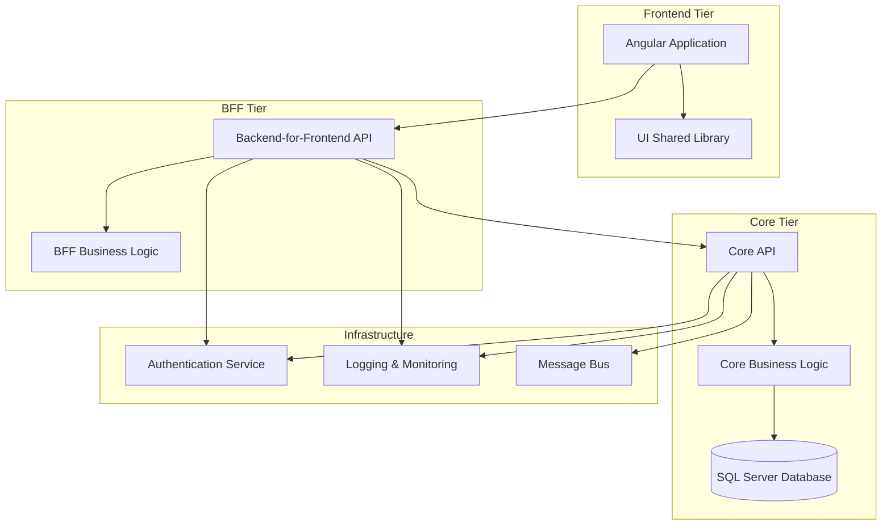
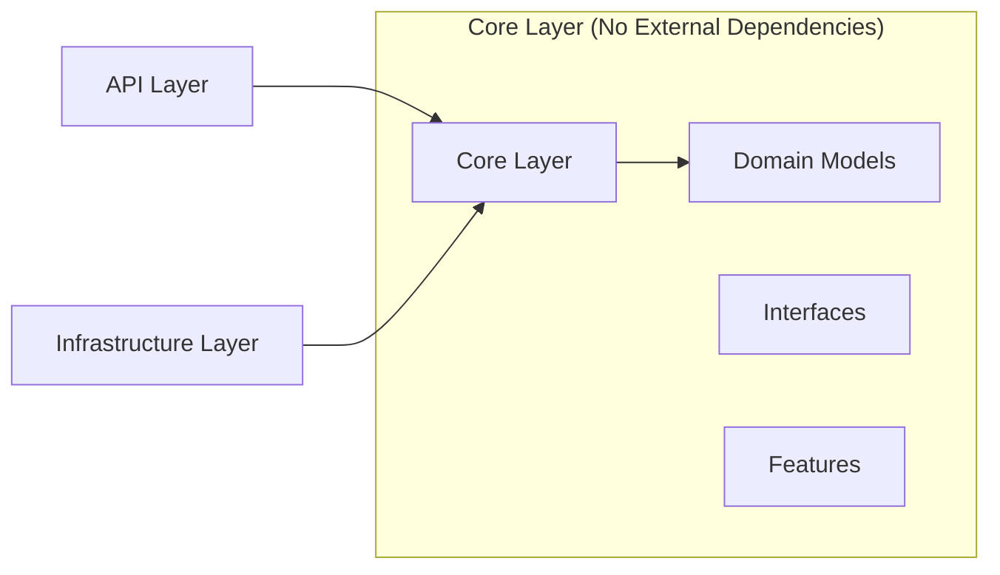
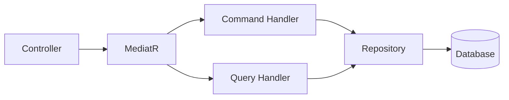
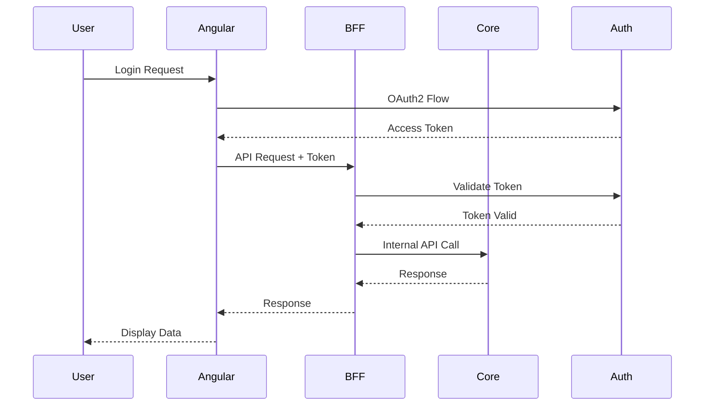
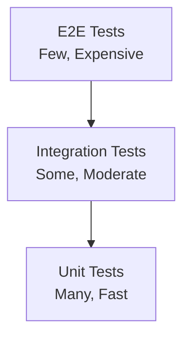

# Vertex Architecture Guide

> **Purpose**: This guide explains the architectural patterns and design decisions used in Vertex projects to help Cursor AI understand and implement consistent solutions.

## 🏛️ System Architecture Overview

### High-Level Architecture



### Architecture Layers

#### 1. Frontend Layer
**Technology**: Angular 20+ with Standalone Components
- **Purpose**: User interface and user experience
- **Responsibilities**: 
  - User input handling
  - Data presentation
  - Client-side validation
  - Routing and navigation

#### 2. BFF (Backend-for-Frontend) Layer
**Technology**: .NET 8 Web API with Clean Architecture
- **Purpose**: Frontend-specific API gateway
- **Responsibilities**:
  - Data aggregation from multiple sources
  - Response transformation for UI needs
  - Frontend-specific business logic
  - Authentication integration

#### 3. Core API Layer
**Technology**: .NET 8 Web API with Clean Architecture
- **Purpose**: Domain-focused CRUD operations
- **Responsibilities**:
  - Core business logic
  - Data persistence
  - Domain event handling
  - Integration with external systems

#### 4. Infrastructure Layer
**Technology**: Shared services and libraries
- **Components**:
  - Authentication (OAuth2/OIDC)
  - Logging & Monitoring (Azure Application Insights)
  - Message Bus (Azure Service Bus)
  - Database (SQL Server)

## 🏗️ Clean Architecture Implementation

### Dependency Flow



### Project Structure Mapping

#### API Project (`SE.Sustainability.Vertex.[Domain].API`)
- **Role**: Presentation Layer
- **Dependencies**: Core, Infrastructure
- **Contains**: Controllers, Authentication, Middleware, Configuration

#### Core Project (`SE.Sustainability.Vertex.[Domain].Core`)
- **Role**: Business Logic Layer
- **Dependencies**: Models only
- **Contains**: Features (CQRS), Validators, Mappers, Interfaces

#### Infrastructure Project (`SE.Sustainability.Vertex.[Domain].Infrastructure.SqlServer`)
- **Role**: Data Access Layer
- **Dependencies**: Core
- **Contains**: DbContext, Entities, Repositories

## 🔄 CQRS Pattern Implementation

### Command Query Separation



### Feature Organization

```
Features/
└── Template/
    ├── Commands/
    │   ├── CreateTemplateCommand.cs
    │   ├── UpdateTemplateCommand.cs
    │   └── DeleteTemplateCommand.cs
    ├── Queries/
    │   ├── GetTemplateQuery.cs
    │   └── ListTemplatesQuery.cs
    ├── Handlers/
    │   ├── CreateTemplateHandler.cs
    │   ├── UpdateTemplateHandler.cs
    │   ├── DeleteTemplateHandler.cs
    │   ├── GetTemplateHandler.cs
    │   └── ListTemplatesHandler.cs
    └── Validators/
        ├── CreateTemplateValidator.cs
        └── UpdateTemplateValidator.cs
```

### Request/Response Flow

1. **Client Request** → Controller
2. **Controller** → MediatR.Send(Request)
3. **MediatR** → Appropriate Handler
4. **Handler** → Repository/Service
5. **Repository** → Database
6. **Response** ← Handler ← Repository
7. **Client** ← Controller ← MediatR

## 🔌 Dependency Injection Pattern

### Service Registration Strategy

#### Installer Pattern
```csharp
public static class ApplicationInstaller
{
    public static IServiceCollection InstallApplicationDependencies(
        this IServiceCollection services, 
        IConfiguration configuration)
    {
        // Register application services
        services.AddMediatR(cfg => cfg.RegisterServicesFromAssembly(Assembly.GetExecutingAssembly()));
        services.AddValidatorsFromAssembly(Assembly.GetExecutingAssembly());
        
        return services;
    }
}
```

#### Usage in Program.cs
```csharp
public class TemplateApi : VertexApiBase<TemplateApi>
{
    protected override void ConfigureServices()
    {
        base.ConfigureServices();
        
        Services
            .InstallDbDependencies(Builder.Configuration)
            .InstallApplicationDependencies(Builder.Configuration);
    }
}
```

### Service Lifetimes
- **Scoped**: Repositories, Handlers, Validators
- **Singleton**: Configuration, Logging, Caching
- **Transient**: Lightweight services, Mappers

## 📊 Data Access Patterns

### Repository Pattern

```csharp
public interface IEFRepository<T> where T : class
{
    Task<ServiceResponse<IEnumerable<T>>> GetAllAsync();
    Task<ServiceResponse<T>> GetByIdAsync(int id);
    Task<ServiceResponse<T>> CreateAsync(T entity);
    Task<ServiceResponse<T>> UpdateAsync(T entity);
    Task<ServiceResponse<bool>> DeleteAsync(int id);
}
```

### Entity Framework Configuration

#### DbContext
```csharp
public class TemplateDbContext : DbContext
{
    public TemplateDbContext(DbContextOptions<TemplateDbContext> options) : base(options) { }
    
    public DbSet<TemplateEntity> Templates { get; set; }
    
    protected override void OnModelCreating(ModelBuilder modelBuilder)
    {
        modelBuilder.ApplyConfigurationsFromAssembly(Assembly.GetExecutingAssembly());
    }
}
```

#### Entity Configuration
```csharp
public class TemplateEntityConfiguration : IEntityTypeConfiguration<TemplateEntity>
{
    public void Configure(EntityTypeBuilder<TemplateEntity> builder)
    {
        builder.HasKey(e => e.Id);
        builder.Property(e => e.Name).IsRequired().HasMaxLength(100);
        builder.Property(e => e.Description).HasMaxLength(500);
    }
}
```

## 🔄 Event-Driven Architecture

### Domain Events

```csharp
public record TemplateCreatedEvent(int TemplateId, string Name) : INotification;

public class TemplateCreatedEventHandler : INotificationHandler<TemplateCreatedEvent>
{
    public async Task Handle(TemplateCreatedEvent notification, CancellationToken cancellationToken)
    {
        // Handle domain event
    }
}
```

### Integration Events (Azure Service Bus)

```csharp
public class TemplateService
{
    private readonly IEventPublisher _eventPublisher;
    
    public async Task CreateTemplateAsync(Template template)
    {
        // Create template
        await _repository.CreateAsync(template);
        
        // Publish integration event
        await _eventPublisher.PublishAsync(new TemplateCreatedIntegrationEvent
        {
            TemplateId = template.Id,
            Name = template.Name,
            CreatedAt = DateTime.UtcNow
        });
    }
}
```

## 🎨 Frontend Architecture

### Angular Standalone Components

```typescript
@Component({
  selector: 'app-template-list',
  standalone: true,
  imports: [CommonModule, TemplateItemComponent],
  templateUrl: './template-list.component.html',
  styleUrls: ['./template-list.component.css']
})
export class TemplateListComponent implements OnInit {
  templates$ = this.templateService.getTemplates();
  
  constructor(private templateService: TemplateService) {}
}
```

### Service Pattern

```typescript
@Injectable({
  providedIn: 'root'
})
export class TemplateService {
  private baseUrl = `${this.config.apiUrl}/template`;
  
  constructor(
    private http: HttpClient,
    private config: ConfigService
  ) {}
  
  getTemplates(): Observable<Template[]> {
    return this.http.get<Template[]>(this.baseUrl);
  }
  
  createTemplate(template: CreateTemplate): Observable<Template> {
    return this.http.post<Template>(this.baseUrl, template);
  }
}
```

### State Management

```typescript
@Injectable({
  providedIn: 'root'
})
export class TemplateStateService {
  private templatesSubject = new BehaviorSubject<Template[]>([]);
  public templates$ = this.templatesSubject.asObservable();
  
  private loadingSubject = new BehaviorSubject<boolean>(false);
  public loading$ = this.loadingSubject.asObservable();
  
  constructor(private templateService: TemplateService) {}
  
  loadTemplates(): void {
    this.loadingSubject.next(true);
    this.templateService.getTemplates().subscribe({
      next: (templates) => {
        this.templatesSubject.next(templates);
        this.loadingSubject.next(false);
      },
      error: () => this.loadingSubject.next(false)
    });
  }
}
```

## 🔐 Security Architecture

### Authentication Flow



### Authorization Implementation

#### API Authorization
```csharp
[Authorize(Roles = "TemplateAdmin,TemplateUser")]
[HttpPost]
public async Task<ActionResult<Template>> CreateTemplate(CreateTemplateCommand command)
{
    var result = await _mediator.Send(command);
    return Ok(result);
}
```

#### Angular Route Guards
```typescript
@Injectable()
export class TemplateGuard implements CanActivate {
  constructor(private authService: AuthService) {}
  
  canActivate(): boolean {
    return this.authService.hasRole('TemplateUser');
  }
}
```

## 📈 Scalability Patterns

### Horizontal Scaling
- **Stateless Services**: All APIs are stateless
- **Load Balancing**: Multiple API instances
- **Database Scaling**: Read replicas, connection pooling

### Caching Strategy
```csharp
public class CachedTemplateService : ITemplateService
{
    private readonly ITemplateService _templateService;
    private readonly IMemoryCache _cache;
    
    public async Task<Template> GetTemplateAsync(int id)
    {
        var cacheKey = $"template-{id}";
        
        if (_cache.TryGetValue(cacheKey, out Template cached))
            return cached;
            
        var template = await _templateService.GetTemplateAsync(id);
        _cache.Set(cacheKey, template, TimeSpan.FromMinutes(15));
        
        return template;
    }
}
```

### Performance Monitoring

Performance monitoring is handled by the `vertex-dotnet-api-sdk` and Application Insights integration. Custom performance middleware can be added as needed - see `docs/RECOMMENDED_ADDITIONS.md` for examples.

## 🧪 Testing Architecture

### Test Pyramid



### Testing Strategies

#### Unit Tests (70%)
- Test individual classes/methods in isolation
- Mock all dependencies
- Fast execution, high code coverage

#### Integration Tests (20%)
- Test API endpoints with real database
- Test service integrations
- Verify data flow between layers

#### E2E Tests (10%)
- Test complete user workflows
- Browser automation
- Critical path validation

---

**Note for Cursor**: This architecture provides a scalable, maintainable foundation for Vertex applications. Follow these patterns consistently to ensure system coherence and developer productivity.
