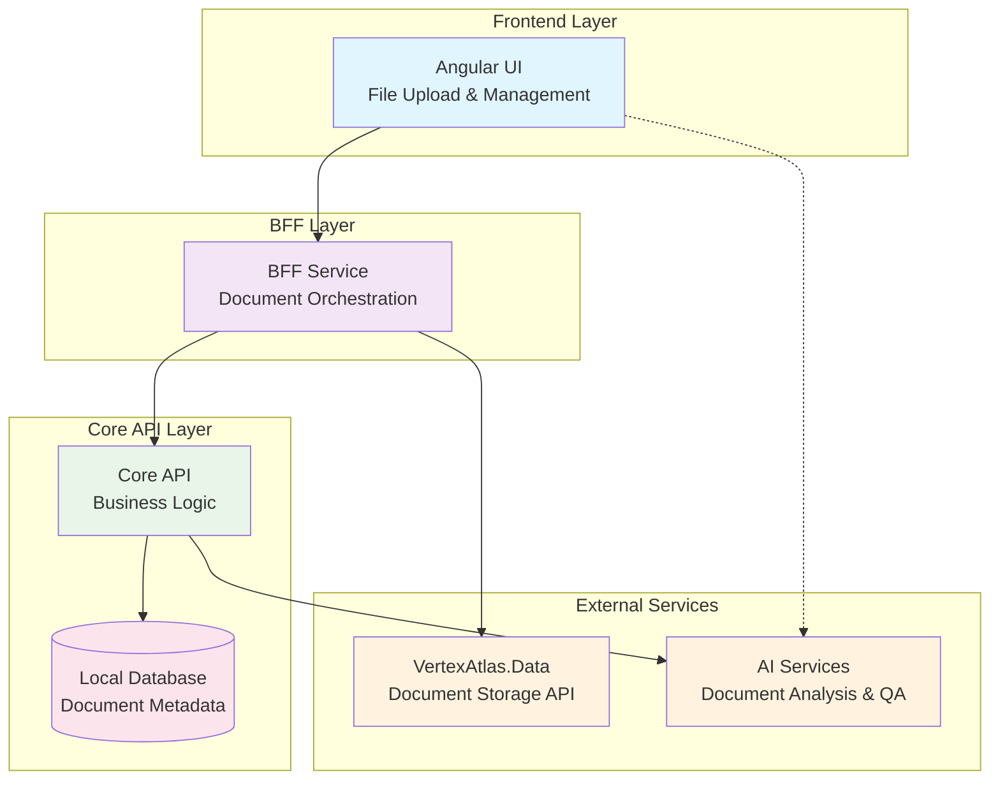
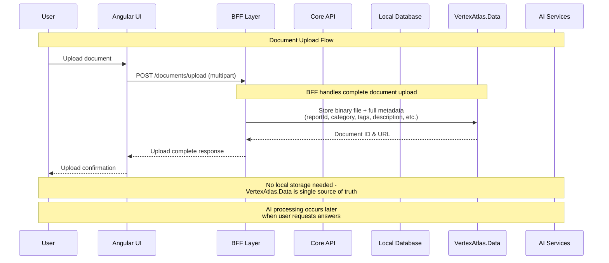
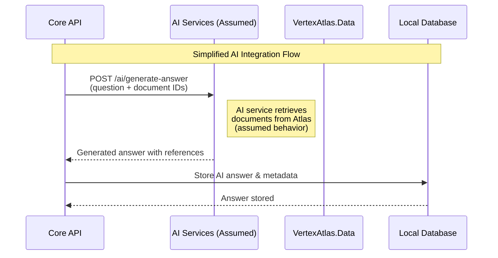
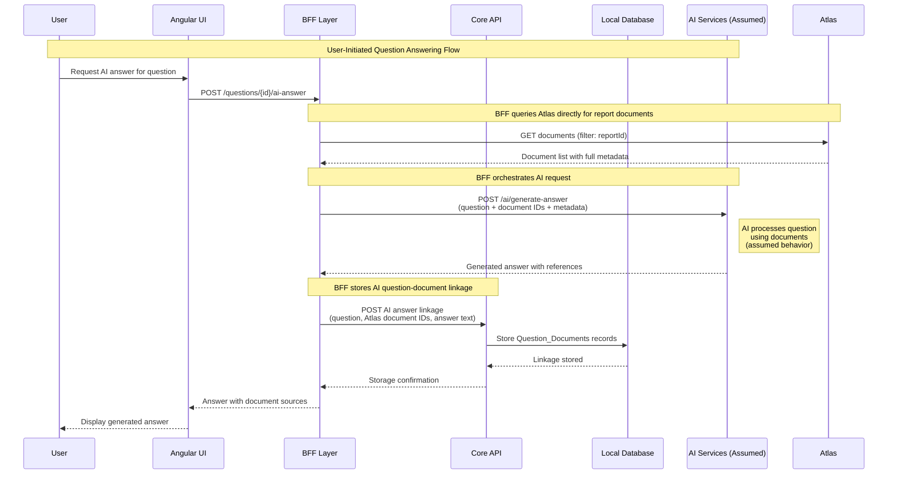

### **ADR-0005-document-upload-ai-integration**

**Title:** Document Upload and AI-Powered Question Answering Integration

---

### **1. Status**

**Status:** Proposed

**Date:** 2025-08-21

**Decision Makers:** Tech Lead, AI Architect, Frontend Lead, Product Owner

---

### **2. Context**

**2.1. Background**
The Disclosure Management platform requires the ability for users to upload supporting documents that will be processed by AI services to automatically generate answers for qualitative questions in ESG reporting frameworks. Users currently must manually research and write answers for hundreds of qualitative questions, which is time-intensive and inconsistent across teams.

**2.2. Problem Statement**
ESG disclosure reporting involves numerous qualitative questions that require evidence-based answers sourced from company documents (annual reports, sustainability reports, policies, etc.). Currently, users must manually review documents and craft responses, leading to:
- Inconsistent answer quality and formatting
- Significant time investment in manual research
- Difficulty maintaining document-to-answer traceability
- Lack of automated content analysis and suggestion capabilities

**2.3. Constraints & Requirements**
- **Technical Constraints:** Must integrate with VertexAtlas.Data API for document storage, maintain existing Clean Architecture patterns
- **Security Constraints:** Document content must be encrypted, access controlled by user permissions
- **Business Constraints:** Must support common business document formats (PDF, DOCX, XLSX, PPT)
- **AI Constraints:** Integration with external AI services for content analysis and question answering
- **Platform Constraints:** Must align with Vertex authentication, storage, and API patterns

**2.4. Stakeholders**
- **Primary:** ESG professionals, Report authors, Compliance teams
- **Secondary:** IT administrators, AI service providers, Document management teams
- **Tertiary:** External auditors, Regulatory bodies (indirect)

---

### **3. Decision**

**3.1. Decision Statement**
Implement a comprehensive document upload and AI integration system using VertexAtlas.Data API for document storage, with a three-tier architecture (Core API → BFF → Frontend) that enables document upload, metadata management, AI-powered content analysis, and intelligent question-answer suggestions while maintaining existing architectural patterns and security standards.

**3.2. Solution Overview**
- **Technology Stack:** VertexAtlas.Data SDK, Angular file upload components, .NET Core document processing
- **Architecture Pattern:** Layered architecture with document metadata stored locally and files stored in VertexAtlas.Data
- **Implementation Approach:** Phased rollout starting with basic upload/storage, then AI integration
- **Integration Points:** VertexAtlas.Data API, AI services via dedicated processing pipeline, existing question/answer workflow

**3.3. Technical Specifications**

**Frontend Layer:**
- **Document Upload Component:** Angular drag-and-drop interface using vertex-ui-shared components
- **Document Management:** List view with search, filter, and metadata editing capabilities
- **AI Integration UI:** Question suggestion interface and confidence scoring display
- **File Validation:** Client-side type/size validation before upload

**BFF Layer Enhancements:**
- **Document Controller:** RESTful endpoints for upload, metadata management, and retrieval
- **VertexAtlas.Data Integration:** Direct file upload to document repository with SDK integration
- **AI Integration Service:** Orchestration of question answering requests
- **Document Transformation:** Metadata enrichment and format standardization

**Core API Integration:**
- **AI Question Linkage:** Store relationships between framework questions and Atlas documents for AI-generated answers
- **Business Logic Layer:** Document validation, workflow integration, and report context management
- **AI Service Integration:** On-demand question answering using uploaded documents

**Database Schema:**
```sql
-- NO local document storage - VertexAtlas.Data is single source of truth
-- Document-to-question linkage for AI suggestions
Question_Documents: (Id, Framework_Question_Id, Report_Id, Atlas_Document_Id,
                     Relevance_Score, AI_Confidence, Suggested_Answer_Text)
```

**Document Storage Strategy:**
- **VertexAtlas.Data Repository**: Single source of truth for ALL document data (files, metadata, relationships)
- **Local Storage**: NONE - eliminates data consistency issues
- **Benefits**: Real-time data, cross-service consistency, simplified architecture, no event sync complexity
- **Performance**: BFF queries VertexAtlas.Data directly for document lists (filtered by reportId metadata)

**3.4. Integration Architecture**



### **4. External Service Integration**

**4.1. Document Repository API (VertexAtlas.Data)**

**Document Storage Operations:**
```csharp
// Upload document to VertexAtlas.Data using SDK
// BFF Layer Implementation
var byteArrayPart = new ByteArrayPart(command.FileContent, command.FileName, command.ContentType);

// Create metadata for VertexAtlas.Data
var atlasMetadata = new JsonObject
{
    ["fileName"] = command.FileName,
    ["contentType"] = command.ContentType,
    ["reportId"] = command.ReportId,
    ["category"] = command.DocumentCategory,
    ["description"] = command.Description ?? "",
    ["tags"] = command.DocumentTags ?? "[]"
};

var atlasUploadResponse = await _atlasApi.UploadDocument(
    byteArrayPart, 
    location: (int)Location.Global, // Use Organization location for document management
    metadata: atlasMetadata);

// SDK Response Format
{
  "documentId": "atlas_doc_550e8400-e29b-41d4-a716-446655440000",
  "uploadUrl": "https://atlas.vertex.com/documents/...",
  "checksum": "sha256:abc123...",
  "sizeBytes": 2048576,
  "location": 0, // Location.Global
  "metadata": {
    "fileName": "annual-report-2024.pdf",
    "contentType": "application/pdf",
    "reportId": "report_456",
    "category": "sustainability_report",
    "description": "Company annual sustainability report",
    "tags": "[\"ESG\", \"2024\", \"annual\"]"
  },
  "status": "uploaded"
}
```

```csharp
// Retrieve document metadata
GET /api/documents/{documentId}
Headers:
  - Authorization: Bearer {vertex_token}
  - X-Tenant-Id: {tenant_id}

Response:
{
  "documentId": "atlas_doc_550e8400-e29b-41d4-a716-446655440000",
  "originalFileName": "annual-report-2024.pdf",
  "contentType": "application/pdf",
  "sizeBytes": 2048576,
  "uploadDate": "2024-03-15T14:30:00Z",
  "downloadUrl": "https://atlas.vertex.com/documents/download/...",
  "expiresAt": "2024-03-15T15:30:00Z", // Temporary download URL
  "metadata": {
    "category": "sustainability_report",
    "tags": ["ESG", "2024", "annual"],
    "description": "Company annual sustainability report"
  }
}
```

```csharp
// Download document content
GET /api/documents/{documentId}/download
Headers:
  - Authorization: Bearer {vertex_token}
  - X-Tenant-Id: {tenant_id}

Response: Binary file content with appropriate Content-Type header
```

```csharp
// Delete document
DELETE /api/documents/{documentId}
Headers:
  - Authorization: Bearer {vertex_token}
  - X-Tenant-Id: {tenant_id}

Response: 204 No Content
```

**4.2. AI Service Integration API (Assumed)**

> **Note:** The following AI service endpoints are assumptions for planning purposes. Actual implementation details will depend on the AI API specifications.

**Question Answering Operations:**
```csharp
// Generate AI answer for framework question using uploaded documents
// ASSUMED ENDPOINT - actual implementation may vary
POST /api/ai/generate-answer
Headers:
  - Authorization: Bearer {ai_service_token}
  - Content-Type: application/json

Body:
{
  "questionText": "Describe your organization's approach to managing climate-related risks and opportunities.",
  "documentIds": [
    "atlas_doc_550e8400-e29b-41d4-a716-446655440000",
    "atlas_doc_661f9511-f3ac-52e5-b827-557766551111"
  ],
  "metadata": {
    "reportId": "report_456",
    "frameworkId": "tcfd_2024",
    "questionType": "qualitative",
    "maxResponseLength": 500
  }
}

// ASSUMED RESPONSE FORMAT
Response:
{
  "generatedAnswer": "Generated response text based on document analysis...",
  "confidence": 0.85,
  "documentReferences": [
    {
      "documentId": "atlas_doc_550e8400-e29b-41d4-a716-446655440000",
      "relevantSections": ["Risk Management", "Climate Strategy"]
    }
  ],
  "processingMetadata": {
    "processingTime": "2.1s",
    "tokensUsed": 1150
  }
}
```

**Additional AI Service Assumptions:**
- AI service will accept document IDs and retrieve content from VertexAtlas.Data
- Service will provide confidence scoring for generated answers
- Document references and source attribution will be included in responses
- Authentication and authorization will be handled via standard bearer tokens
- Processing will be asynchronous for large document sets
- Error handling will include appropriate HTTP status codes and error messages

**4.3. Service Integration Flow**

**Document Upload Flow:**


**AI Answer Generation Flow (Assumed):**


**Question Answering User Flow:**


**4.4. Error Handling & Resilience**

```csharp
// Retry configuration for VertexAtlas.Data calls
public class DocumentRepositoryConfig
{
    public int MaxRetries { get; set; } = 3;
    public TimeSpan InitialDelay { get; set; } = TimeSpan.FromSeconds(1);
    public TimeSpan MaxDelay { get; set; } = TimeSpan.FromSeconds(30);
    public double BackoffMultiplier { get; set; } = 2.0;
}

// Circuit breaker for AI service calls  
public class AiServiceConfig
{
    public int FailureThreshold { get; set; } = 5;
    public TimeSpan CircuitOpenDuration { get; set; } = TimeSpan.FromMinutes(2);
    public TimeSpan RequestTimeout { get; set; } = TimeSpan.FromSeconds(30);
}

// Common error responses
{
  "error": {
    "code": "DOCUMENT_UPLOAD_FAILED",
    "message": "Failed to upload document to repository",
    "details": {
      "documentSize": "5MB",
      "maxAllowedSize": "10MB",
      "fileType": "application/pdf"
    },
    "retryable": true,
    "correlationId": "uuid-12345"
  }
}
```

---

### **5. Consequences**

**5.1. Benefits**
- **User Productivity:** Automated content analysis reduces manual research time significantly
- **Answer Quality:** AI-generated suggestions improve consistency and completeness of responses
- **Traceability:** Clear audit trail from documents to answers enhances compliance capabilities
- **Platform Alignment:** Leverages existing Vertex infrastructure and patterns
- **Cross-Service Accessibility:** All services access the same document data from VertexAtlas.Data with no duplication
- **Scalability:** VertexAtlas.Data provides enterprise-grade document storage and management with rich metadata capabilities
- **Data Consistency:** Zero local document storage eliminates all data synchronization issues and stale data problems
- **Real-time Updates:** Document changes by other services are immediately visible to Disclosure Management
- **Simplified Architecture:** No event handling or data sync complexity required
- **Security:** Centralized document security and access control through platform services

**5.2. Trade-offs**
- **External Dependency:** Increased reliance on VertexAtlas.Data availability and performance for all document operations
- **Network Latency:** Document list queries require external API calls rather than local database access
- **Cost:** Document storage and AI processing may increase operational costs
- **Learning Curve:** Users need training on new document management workflows

**5.3. Risks**
- **AI Accuracy:** AI-generated answers may require human verification and editing
- **Integration Failures:** VertexAtlas.Data or AI service outages impact document functionality
- **Performance Degradation:** Large document uploads could impact system performance
- **Compliance:** Document retention and privacy policies must align with regulatory requirements
- **Version Management:** Document updates and versioning complexity

**5.4. Monitoring & Success Metrics**
- **Performance Metrics:** Upload success rates, processing times, and system responsiveness
- **Usage Metrics:** Documents uploaded per report, AI suggestion acceptance rate
- **Quality Metrics:** Answer completeness improvement, user satisfaction scores
- **System Metrics:** VertexAtlas.Data API response times, error rates

---

### **6. Implementation Notes**

**6.1. Phase 1: Core Document Management**
- VertexAtlas.Data SDK integration and authentication setup
- Basic document upload and metadata storage
- Simple document list and management UI
- Database schema migration for document metadata

**6.2. Phase 2: Enhanced Document Features**
- Advanced metadata management (categories, tags, descriptions)
- Document search and filtering capabilities
- Document preview and download functionality
- Integration with report workflow

**6.3. Phase 3: AI Integration (Assumed Implementation)**
- AI service integration for on-demand question answering
- Document context retrieval for AI processing
- Answer generation and display with document references
- Basic confidence scoring and user feedback mechanisms

**6.4. Phase 4: Advanced Features**
- Bulk document operations and batch processing
- Document versioning and change tracking
- Advanced analytics and usage reporting
- Performance optimization and caching strategies

**6.5. Technical Considerations**
- **Error Handling:** Comprehensive error handling for upload failures, network issues, and AI service timeouts
- **File Validation:** Client and server-side validation for file types, sizes, and content security
- **Audit Logging:** Track all document operations for compliance and security monitoring
- **Backup/Recovery:** Coordinate with VertexAtlas.Data backup policies for business continuity

**6.6. Security Implementation**
- **Access Control:** Document access restricted by report permissions and user roles
- **Encryption:** Document metadata encrypted at rest, files encrypted by VertexAtlas.Data
- **Audit Trail:** Complete logging of document upload, access, modification, and deletion events
- **Data Privacy:** Implement data retention policies and user consent mechanisms

---